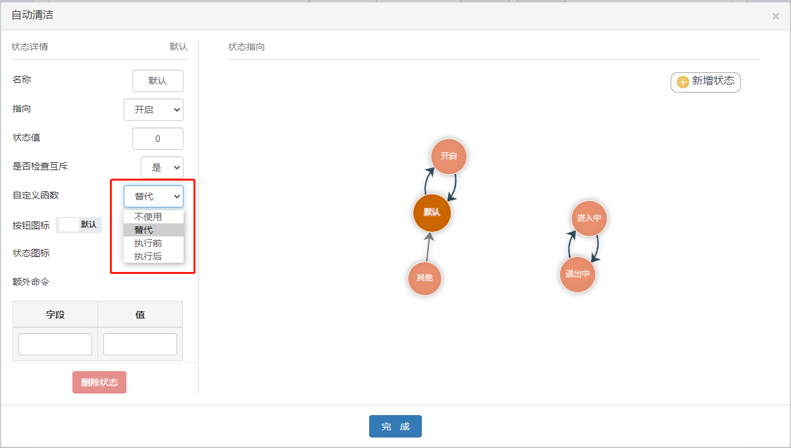

# 自定义函数

## 自定义接入函数

### 接入方式

可在平台模板定义处定义自定义接入函数的接入方式



不同接入方式的作用如下表所示

| 接入方式 | 不使用 | 替代 | 执行前 | 执行后 |
| :----: | :----: | :----: | :----: | :----: |
| 标识符 | undefined | replace | before | after |
| 作用 | / | 替代原有事件 | 事件执行前接入自定义函数 | 事件执行后接入自定义函数 |

### 使用方法

在`machine\actions.js`内定义了`runCustomizeFunction`函数

``` js
const { customizeFunction } = require('@/store/userdef');

function eventHandler(context, { identifier, currentStatusName, nextStatusName }) {
  ...
  // 定义自定义函数执行函数
  const runCustomizeFunction = identifier => {
    // 先判断是否存在，如果存在，传入context与参数currentStatusName与nextStatusName执行
    const fn = customizeFunction[identifier];
    if (fn) {
      fn(context, currentStatusName, nextStatusName);
    } else {
      console.info('找不到自定义函数', { identifier });
    }
  };
  ...
  runCustomizeFunction()
  ...
}
```

`runCustomizeFunction`提供的属性如下：
| 属性名 | context | currentStatusName | nextStatusName |
| :----: | :----: | :----: | :----: |
| 类型 | Object | String | String |
| 示例 | { commit, dispatch, ... } | status_1 | status_2 |
| 备注 | vuex的执行上下文 | 当前statusName(现态) | 即将进入的statusName(次态) |

### 示例

以自清洁作为例子，实现不同状态下弹出不同提示

``` js
export const customizeFunction = {
  AutoClean: async ({ commit, dispatch }, currentStatusName) => {
    const switchClean = value => {
      dispatch('SEND_DATA', { AutoClean: value }, { root: true });
      commit('control/SET_DATA_OBJECT', { CleanState: value, AutoClean: value ? 2 : 3 }, { root: true });
    };
    let res = 0;
    switch (currentStatusName) {
      case 'default':
        showToast('正在启动自清洁', 1);
        switchClean(1);
        break;
      case 'status_1':
        res = await showConfirm('提示', '是否退出自清洁功能？');
        Number(res) && switchClean(0);
        break;
      case 'status_2':
        showToast('正在进入自清洁中，请耐心等待...', 1);
        break;
      case 'status_3':
        showToast('正在退出自清洁中，请耐心等待...', 1);
        break;
      default:
        break;
    }
  }
}
```

## 自定义初始化函数

在状态机初始化时运行一次

### 示例

``` js
export const customizeInit = {
  AppTimer: () => {
    console.log('初始化时打印这句话');
  }
};
```
