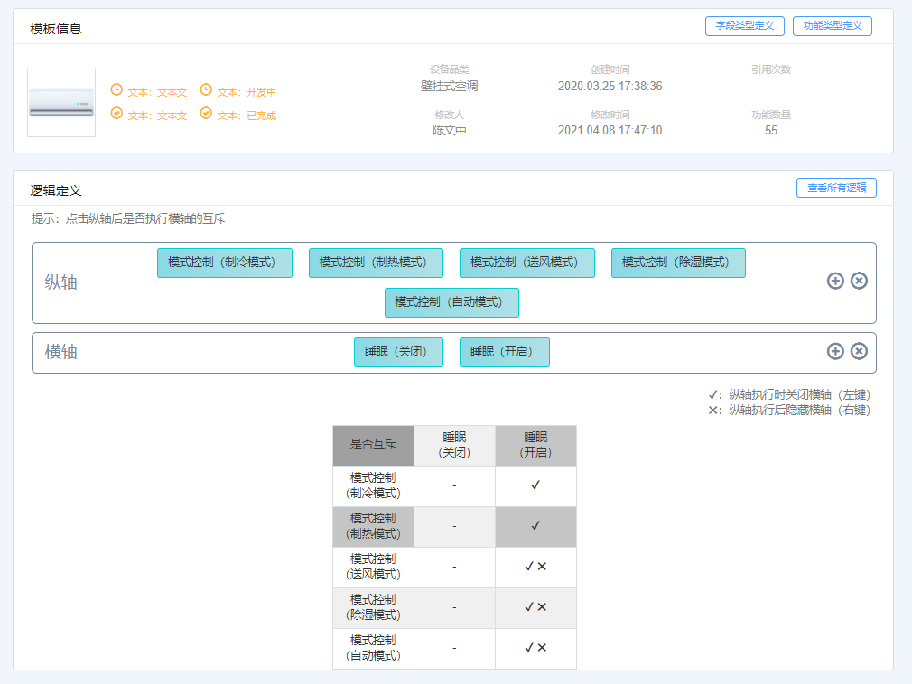
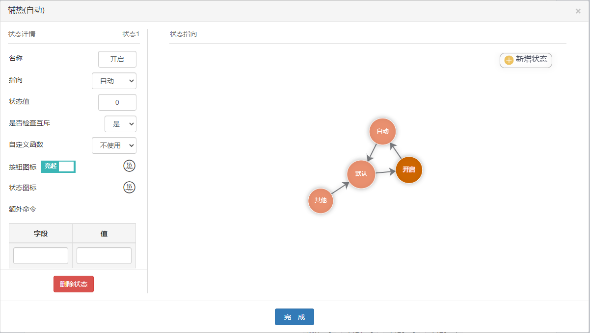
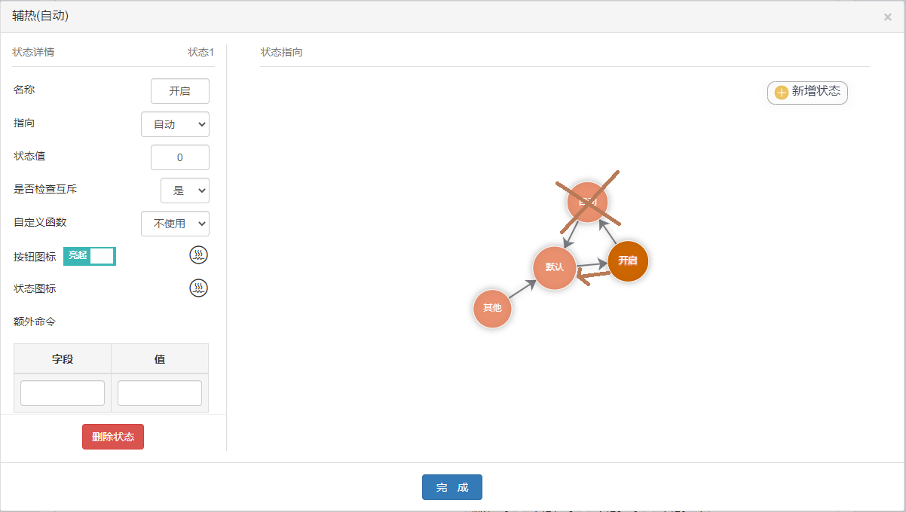

# 互斥关系处理

在平台上可定义两个非同源状态之间的关系，其中包含了**排斥**和**隐藏**



## 排斥

在配置文件中，排斥关系以`excludeMap`作为属性名，结构如下

``` js
"excludeMap": {
  "Pow_default": [
    "Sleep_status_1",
    "AntiDirectBlow_status_1",
    "BabySleep_status_1",
    "BottomSleep_status_1",
    "BottomSleep(ordinary)_status_1",
    "coolFeel_status_1",
    "SmartSleep_status_1",
    "Health_status_1",
    "UDFanPort(Auto)_status_1",
    "UDFanPort(Auto)_status_2"
  ],
  "Pow_status_1": ["InMacClean_status_1"],
  "SmartSleep_status_1": ["Fan_tur_status_1"],
  "AutoClean_status_1": ["InMacClean_status_1"],
  "InMacClean_status_1": ["AutoClean_status_1"]
}
```

`excludeMap`中以`statusName`作为属性名，其属性值为数组，记录了所有需要排斥的`statusName`

状态机中，每个事件执行结束后都会调用`checkLogic`方法检查一次互斥

``` js {19}
function checkLogic(context, identifier, statusName) {
  const { state, getters } = context;
  const checkStatusName = statusName || getters.statusMap[identifier].statusName;
  const checkStateName = `${identifier}_${checkStatusName}`;
  // 提取互斥逻辑
  const excludeStateNameArr = state.baseData.excludeMap[checkStateName];
  // 如果该状态存在互斥
  if (!excludeStateNameArr || !excludeStateNameArr.length) return;
  // 轮询互斥关系
  excludeStateNameArr.forEach(stateName => {
    // 找到互斥的identifier
    const identifier = getters.stateNameToId[stateName];
    if (!identifier) return;
    // 获取identifier的当前statusName
    const currentStatusName = getters.fakeStatusMap[identifier].statusName;
    // 获取identifier的当前stateName
    const currentStateName = `${identifier}_${currentStatusName}`;
    // 如果当前stateName被排斥，则跳转到指向状态
    stateName === currentStateName && excludeStatus(identifier, currentStatusName);
  });
}
```

如上所示，如`checkLogic`方法成功检测到排斥，会向状态机提交一个`excludeStatus`事件

``` js
class stateMachine {
  ...
  excludeStatus(identifier, fromStatusName) {
    this.stateQueue.push({ identifier, fromStatusName, type: 'exclude' });
  }
}
```

- `excludeStatus`会向事件队列尾提交事件，标明发生事件的`identifier`, `statusName`以及`type`
- 事件队列根据`type`解析排斥事件，输出指令

## 隐藏

在配置文件中，隐藏关系以`hideMap`作为属性名，结构如下

``` js
"hideMap": {
  "Pow_default": [
    "TemStep_status_1",
    "SwingUD_status_1",
    "SwingLR_status_1",
    "Health_status_1"
  ],
  "Mod_default": ["AssHt(Auto)_status_1", "AssHt(Auto)_status_2"],
  "Mod_status_1": ["coolFeel_status_1"],
  "Mod_status_2": [
    "Fan_status_6",
    "Fan_status_7"
  ]
  "Scenes_status_1": [
    "AppTimer_status_1",
    "TemSen_default",
    "Elc_status_1"
  ]
}
```

`hideMap`中以`statusName`作为属性名，其属性值为数组，记录了所有需要隐藏的`statusName`

每当状态机需要获取`statusName`指向的时候，会先根据`hideMap`判断指向状态是否被隐藏，如被隐藏，则不能被指向



如上图所示，在所有状态都没有被隐藏的情况下，状态的指向为`默认` => `开启` => `自动` => `默认`

当`自动`状态被隐藏时，状态的指向为`默认` => `开启` => `默认`，如下图所示


