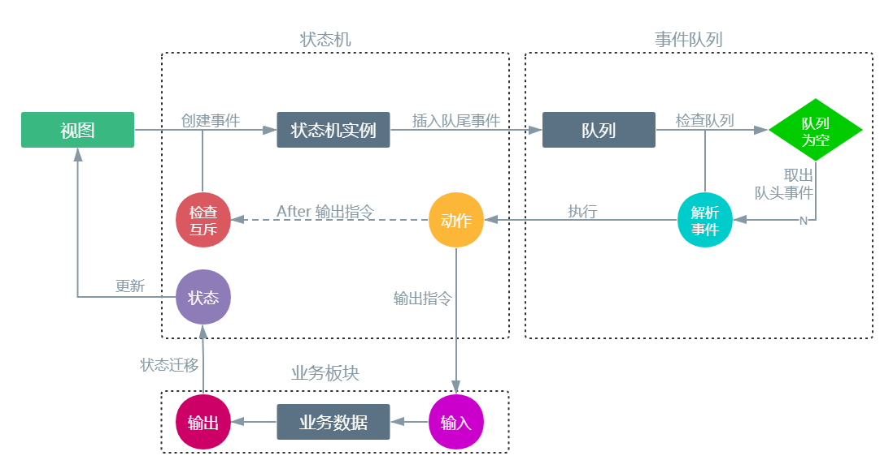

# 状态机设计模式

## 常用名词

### model

- **Type**: `Object`
- **Description**: `model`包含了一个功能的所有定义
- **Example**:

``` js {2}
{
  "order": [ statusName1, statusName2, ... ], // 状态的变更顺序，被map替代，已废弃
  "identifier": String, // 唯一标识符
  "json": String, // 状态字段名
  "type": String, //  类型
  "statusDefine": { statusName1: status1, statusName2: status2, ... }, // status合集，以statusName作为属性名
  "map": { statusName1: statusName2, statusName2: statusName3, ... } // status指向关系合集
}
```

### identifier

- **Type**: `String`
- **Description**: `model`的唯一标识符
- **Example**: `Pow`，`Mod`

### status

- **Type**: `Object`
- **Description**: 状态的抽象定义，作为`statusDefine`的属性，拥有对应的`statusName`作为属性名
- **Example**:

``` js
statusName: {
  "name": String, // 名称，一版不直接使用
  "value": Number|String, // 状态值
  "isCheck": Boolean, // 是否检查互斥
  "customize": String|Boolean, // 自定义函数接入
  "moreCommand": Object, // 可选，更多指令
  // 可选，对应图标
  "icon": {
    "key": String,
    "type": String
  },
  // 可选，对应小图标
  "miniIcon": {
    "key": String
  },
  "hideArr": [stateName1, stateName2, ...], // 可选，隐藏的stateName
  "excludeArr": [stateName1, stateName2, ...] // 可选，排斥的stateName
}
```

### statusName

- **Type**: `String`
- **Description**: `status`的属性名
- **Rule**:
  - 不可重复
  - `statusDefine`下必须存在的`statusName`: `defalut`, `undefined`
  - 新增的`statusName`值为`status_${num}`，`num`从1开始依次递增
- **Example**: `status_1`，`status_2`

### state

- **Type**: `String`
- **Description**: 状态的具象定义
  
### stateName

- **Type**: `String`
- **Description**: 状态名，包含`identifier`与`statusName`信息
- **Rule**: 值为`${identifier}_${statusName}`
- **Example**: `Pow_default`，`Pow_status_1`

**参考:**

- [identifier](#identifier)
- [statusName](#statusname)

## 运行机制

### 前言

为了将功能特性确切划分为互相独立的功能模型（以下统称`model`），增强可扩展性，在定义其数据结构及属性时我们根据`model`在不同情况下的表现细分为状态(以下统称`state`)，状态机设计的主旨就是实现这些`state`的进入条件、动作、以及不同`model`之间`state`的联动。

### 四要素

状态机可归纳为4个要素，即**现态**、**事件**、**动作**、**次态**。这样的归纳，主要是出于对状态机的内在因果关系的考虑。**现态**和**事件**是因，**动作**和**次态**是果。详解如下：

- **现态（State）**：`model`当前所处的`state`，一个`model`至少要包含两个状态：
  - `${identifier}_undefined`：未定义状态，当所有条件（Event）都不满足时进入此状态
  - `${identifier}_default`：默认状态
- **事件（Event）**：当一个事件被满足，将会执行状态的迁移并触发动作（Action），事件可以是某个字段（`model.json`）的值或者一次用户操作
- **动作（Action）**：事件满足后执行的动作。动作会伴随着状态的迁移，但状态的迁移不一定伴随着动作，例：用户操作导致状态迁移时伴随着动作，非用户操作（轮询）导致状态迁移时没有动作。动作有两种类型，根据`stauts.customize`执行对应类型动作：
  - 指令发送，根据`model.json`、`status.value`以及`status.moreCommand`得出需要发送的指令
  - [自定义函数](./Customize.md)
- **次态（Transition）**：事件满足后要迁往的新状态。**次态**是相对于**现态**而言的，**次态**一旦被激活，就转变成新的**现态**了，在`model.map`中定义了每个状态的次态

### 事件队列

模板中使用了自定义的**事件队列**机制来管理状态机产生的**事件（Event）**，遵从了队列的先进先出原则：事件执行机制会从**队头**中获取事件执行，直到队列为空。

每个事件包含了`identifier`、`statusName`信息，队列的数据结构示例：

```json
stateQueue: [
  { "identifier": "Pow", "statusName": "status_1" },
  { "identifier": "Mod", "statusName": "status_4" },
  { "identifier": "Lig", "statusName": "default" }
]
```

#### 事件队列执行机制

以下两个场景会触发事件的执行：

- [事件队列推入新事件](#事件队列推入新事件)
- [当前事件执行完毕](#当前事件执行完毕)

#### 事件队列推入新事件

队列创建时，使用ES5的`Object.defineProperty`改写了`getter`，对队列使用`push`推入事件时，会触发事件的执行：

```js
function creatQueue(context) {
  // 创建队列数组
  let queue = [];
  Object.defineProperty(this, 'stateQueue', {
    // 改写getter方法
    get() {
      // setTimeout把方法放到下一个宏任务，保证队列更新
      setTimeout(() => {
        // 如果队列中存在事件，则执行
        queue.length && RUN_EVENT(context, queue); // RUN_EVENT: 事件执行方法
      }, 0);
      return queue;
    },
    // 改写setter方法
    set(newVal) {
      queue = newVal;
    },
    // 不可删除
    Configurable: false
  });
  this.stateQueue = queue;
}
```

#### 当前事件执行完毕

在当前事件执行完毕后，也会触发一次事件执行：

```js
function RUN_EVENT(context, stateQueue) {
  if (!stateQueue.length) return; // 队列没有事件，退出
  const { identifier, statusName } = stateQueue.shift(); // 从队列中获取事件Event
  ... // 具体实施代码
  RUN_EVENT(context, stateQueue); // 执行下一事件
}
```

### 工作流


